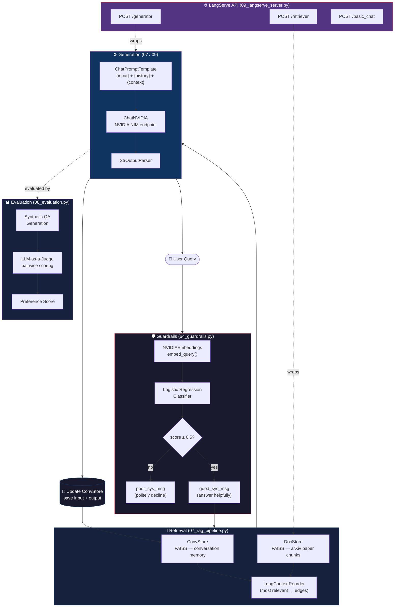

# NVIDIA RAG for LLM Project Code

Personal notes and implementations from the **NVIDIA Deep Learning Institute** course
*"Building RAG Agents for LLMs"*.

This project walks through building a production-style **Retrieval-Augmented Generation (RAG)** system from scratch — starting from raw API calls to LLMs, through LangChain orchestration, all the way to a deployed web service with semantic guardrails and automated evaluation. Each stage is grounded in real code: the `notes/` folder documents the concepts, and `projects/` has clean, runnable Python implementations.

### What this covers

- **LLM integration** — calling hosted models (NVIDIA NIM / OpenAI-compatible APIs) at three levels: raw HTTP, OpenAI client, and LangChain connector
- **LangChain LCEL** — composing pipelines with the pipe `|` operator, dict-based state passing, and streaming output
- **Stateful agents** — maintaining a structured knowledge base across conversation turns using Pydantic slot-filling (`RExtract`)
- **Document processing** — loading, chunking, and progressively summarizing large documents with an iterative refinement loop
- **Embeddings & semantic search** — dual-encoder embedding models, cosine similarity, and document expansion to improve retrieval signal
- **Vector stores** — building and querying FAISS indexes, integrating conversation memory as a vector store, and `LongContextReorder` for better LLM attention
- **RAG pipeline** — wiring retrieval and generation into a coherent chat system grounded in a document corpus
- **Evaluation** — LLM-as-a-Judge pairwise scoring with synthetic QA pairs to measure RAG quality without human labeling
- **API deployment** — serving LangChain chains as REST endpoints with LangServe + FastAPI
- **Semantic guardrails** — training a fast embedding-based classifier to filter off-topic queries before they reach the LLM

### Skills practiced

| Area | Specifics |
|---|---|
| Python | async/await, Pydantic models, generator functions, functools.partial |
| LangChain | LCEL, RunnableLambda, RunnableAssign, RunnableBranch, ChatPromptTemplate |
| ML / NLP | embeddings, cosine similarity, logistic regression, PCA/t-SNE visualization |
| Systems | FastAPI, uvicorn, Docker microservices, HTTP APIs, asyncio concurrency |
| LLMOps | prompt engineering, model selection, streaming, LLM-as-a-Judge evaluation |

### Where this is useful

- **Enterprise document Q&A** — the core RAG pipeline (notebooks 7–9) is directly applicable to internal knowledge bases, support doc search, or research assistant tools
- **Conversational agents with memory** — the stateful knowledge base pattern (notebook 4) works for any domain where an agent needs to track user-provided information across turns
- **Large document ingestion** — the progressive summarization loop (notebook 5) scales to processing hundreds of pages without exceeding LLM context limits
- **Content moderation / guardrails** — the embedding classifier approach (notebook 64) is a fast, low-latency alternative to LLM-based content filtering
- **Automated evaluation pipelines** — the LLM-as-a-Judge pattern (notebook 8) applies to any LLM system where you need scalable quality measurement without manual labeling

> **Note:** The original course notebooks (`course-contents/`) cannot be redistributed
> without NVIDIA authorization and are excluded from this repo. Everything here is
> my own paraphrased notes and independently written implementations.

---

## Repository Structure

```
├── notes/          # Personal study notes per notebook (Markdown)
└── projects/       # Clean Python implementations of course exercises
```

---

## Notes

Personal notes written while going through the course — paraphrased concepts,
key code patterns, and thinking questions.

| File | Topic |
|---|---|
| [1_microservices.md](notes/1_microservices.md) | Docker containers, Jupyter Labs, microservice interaction |
| [2_llms.md](notes/2_llms.md) | LLM deployment tiers, NVIDIA NIM, 3 levels of API access |
| [3_langchain.md](notes/3_langchain.md) | LCEL runnables, pipe operator, dict workflows, Gradio |
| [4_running_state.md](notes/4_running_state.md) | RExtract, slot-filling, stateful conversation chains |
| [5_documents.md](notes/5_documents.md) | Document loaders, text splitting, progressive summarization |
| [6_embeddings.md](notes/6_embeddings.md) | Dual-encoder embeddings, cosine similarity, document expansion |
| [7_vectorstores.md](notes/7_vectorstores.md) | FAISS, RAG retrieval chain, LongContextReorder, conv memory |
| [8_evaluation.md](notes/8_evaluation.md) | LLM-as-a-Judge, synthetic QA, pairwise preference scoring |
| [9_langserve.md](notes/9_langserve.md) | LangServe, FastAPI endpoints, client-server RAG assembly |
| [64_guardrails.md](notes/64_guardrails.md) | Semantic guardrails, async embedding, logistic regression classifier |

---

## Projects

Standalone Python scripts implementing each major concept. Each file runs
independently with a `python <file>.py` entry point.

| File | What it does |
|---|---|
| [utils.py](projects/utils.py) | Shared utilities: `RExtract`, `docs2str`, `default_FAISS`, `RPrint`, etc. |
| [03_langchain_chains.py](projects/03_langchain_chains.py) | LCEL patterns, zero-shot classification, rhyme re-themer chatbot |
| [04_running_state.py](projects/04_running_state.py) | SkyFlow airline chatbot with RExtract-based knowledge base |
| [05_document_summarizer.py](projects/05_document_summarizer.py) | RSummarizer: progressive slot-filling over arXiv paper chunks |
| [06_embeddings.py](projects/06_embeddings.py) | Embedding queries/docs, similarity visualization, document expansion |
| [07_rag_pipeline.py](projects/07_rag_pipeline.py) | Full RAG: multi-paper FAISS docstore + conversation memory |
| [08_evaluation.py](projects/08_evaluation.py) | LLM-as-a-Judge evaluation pipeline for RAG quality |
| [09_langserve_server.py](projects/09_langserve_server.py) | FastAPI server exposing `/retriever` and `/generator` endpoints |
| [64_guardrails.py](projects/64_guardrails.py) | Async embedding + logistic regression semantic guardrail |

### System Architecture



### Quick start

```bash
# Install dependencies
pip install langchain langchain-nvidia-ai-endpoints langchain-community \
            faiss-cpu openai fastapi uvicorn langserve \
            scikit-learn numpy matplotlib gradio pydantic

# Set your NVIDIA API key
export NVIDIA_API_KEY="nvapi-..."

# Run any project
cd projects
python 03_langchain_chains.py
python 07_rag_pipeline.py   # builds docstore_index/ on first run
```

---

## Key Concepts Covered

The course builds a full RAG pipeline from scratch:

```
User Query
    ↓
[Semantic Guardrails]   ← embedding classifier filters off-topic queries
    ↓
[Vector Store Retrieval] ← FAISS similarity search over chunked documents
    ↓
[LongContextReorder]    ← most relevant docs placed at context edges
    ↓
[LLM Generation]        ← grounded answer from retrieved context
    ↓
[LLM-as-a-Judge Eval]  ← automated quality scoring vs synthetic ground truth
    ↓
[LangServe API]         ← productionize as REST endpoints
```

Core LangChain pattern used throughout — LCEL pipe composition:

```python
chain = prompt | llm | StrOutputParser()
rag_chain = {"input": lambda x: x} | RunnableAssign({"context": retriever}) | chain
```

---

## Course Info

- Provider: [NVIDIA Deep Learning Institute](https://www.nvidia.com/en-us/training/)
- Course: Building RAG Agents for LLMs
- Environment: AWS + Jupyter Labs + NVIDIA AI Foundation Model endpoints (NIM)
